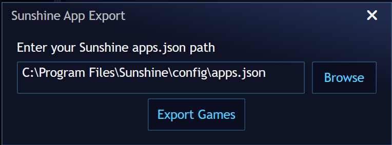

# SunshineAppExport

This is a [Playnite](https://github.com/JosefNemec/Playnite) addon that creates custom ~~[Sunshine](https://github.com/LizardByte/Sunshine)~~ [Apollo](https://github.com/ClassicOldSong/Apollo) apps from the currently selected games in Playnite.

Once imported, you can launch them from [Artemis](https://github.com/ClassicOldSong/moonlight-android) or [Moonlight](https://github.com/moonlight-stream). It even imports your Playnite box art.

By default it will look for ~~Sunshine's~~ Apollo's `apps.json` file at `C:\Program Files\Apollo\config\apps.json`, but if you have a custom ~~Sunshine~~ Apollo install directory, the addon will ask you if you want to change where it looks for `apps.json`. 

